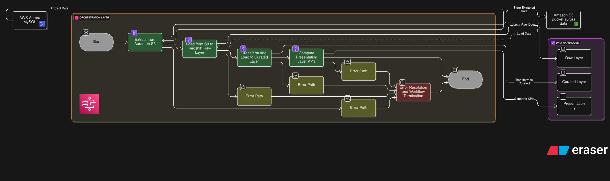
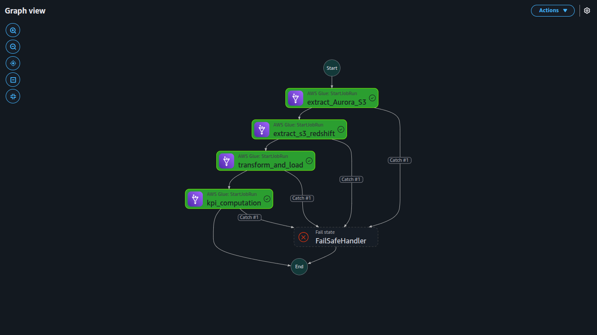

# Batch Data Processing for Rental Marketplace Analytics Documentation

## Project Overview
This project delivers a robust, scalable end-to-end data pipeline for a rental marketplace platform (akin to Airbnb), enabling advanced analytical reporting. The pipeline extracts data from an AWS Aurora MySQL database, leverages Amazon S3 as an intermediate storage layer, and builds a data warehouse in Amazon Redshift. The solution utilizes AWS Glue for ETL processes and AWS Step Functions for workflow orchestration, implementing a multi-layer architecture (Raw, Curated, Presentation) in Redshift to support business intelligence and reporting needs.

## Objectives
- Extract rental listing and user interaction data from AWS Aurora MySQL and store it in Amazon S3.
- Ingest and transform data from S3 into Redshift for structured analytics.
- Establish Raw, Curated, and Presentation layers in Redshift.
- Derive key business metrics for rental performance and user engagement using optimized SQL queries.

## Project Structure
- **`glue_scripts/`**: Houses AWS Glue job scripts.
  - `extract_Aurora_S3.py`: Extracts data from Aurora MySQL (`apartment_attributes`, `apartments`, `bookings`, `user_viewing`) to S3 with data quality validation.
  - `extract_s3_redshift.py`: Loads S3 Parquet files into Redshift Raw layer tables with dynamic schema creation.
  - `transform_and_load.py`: clean and transform data in the raw_layer and load into curated_layer
  - `kpi_computation.py`: perform the various kpi computation and load to presentation_layer
- **`redshift_scripts/`**: Contains SQL scripts for Redshift schema and table definitions.
  - `raw_layer_tables.sql`: Defines Raw layer tables with optimized encodings.
  - `curated_layer.sql`: Defines Curated layer tables with transformed fields.
  - `presentation_layer_tables.sql`: Defines Presentation layer tables for analytics.
- **`images/`**: Includes visual aids.
  - **`images/`**: Includes visual aids.
  - `redshift_data.png`
  - step function diagram

## Workflow Description
The pipeline is orchestrated via AWS Step Functions, as depicted in the . The workflow comprises:

1. **Extract from Aurora to S3**: The Glue job `extract_Aurora_S3.py` uses PySpark to extract data from Aurora MySQL, applies a default data quality rule (`ColumnCount > 0`), and writes to S3 in snappy-compressed Parquet format (e.g., `s3://aurora.data/apartment_attributes/`).
2. **Load to Redshift Raw Layer**: The Glue job `extract_s3_redshift.py` ingests S3 data into Redshift Raw layer tables, creating tables dynamically (e.g., `raw_layer.apartment_attributes`) with predefined schemas.
3. **Transform and Load to Curated Layer**: Transforms raw data (e.g., converting `has_photo` to BOOLEAN, `viewed_at` to DATE) and loads it into Curated layer tables.
4. **Compute Presentation Layer**: Populates analytics tables with business metrics using aggregated queries.
5. **Error Handling**: Includes catch blocks for retries and a `FailSafeHandler` to manage failures, ensuring workflow resilience.
6. 

## Redshift Multi-Layer Architecture

### Raw Layer
Defined in `raw_layer_tables.sql` with optimized encodings and distribution styles:
- **apartment_attributes**: `id` (INT PRIMARY KEY), `category` (VARCHAR(50)), `address` (VARCHAR(500)), `latitude`/`longitude` (FLOAT), etc., with AZ64 encoding for `id`.
- **user_viewing**: `user_id`/`apartment_id` (INT, PRIMARY KEY), `viewed_at` (VARCHAR(20)).
- **apartments**: `id` (INT, PRIMARY KEY), `price` (DOUBLE PRECISION), `currency` (VARCHAR(10)), etc., with AUTO DISTSTYLE.
- **bookings**: `booking_id` (INT PRIMARY KEY), `user_id`/`apartment_id` (INT), `checkin_date` (VARCHAR(20)), etc.

### Curated Layer
Defined in `curated_layer.sql` with transformations and constraints:
- **apartment_attributes**: Adds `has_photo`/`pets_allowed` as BOOLEAN, `price_display_usd` (VARCHAR(50)).
- **user_viewing**: Converts `viewed_at` to DATE, adds `FOREIGN KEY (apartment_id) REFERENCES raw_layer.apartments(id)`.
- **apartments**: Includes `price_usd` (DOUBLE PRECISION), `listing_created_on` as DATE.
- **bookings**: Adds `total_price_usd` (DOUBLE PRECISION), `booking_date`/`checkin_date`/`checkout_date` as DATE, DISTKEY `apartment_id`.

### Presentation Layer
Defined in `presentation_layer_tables.sql` to support analytical reporting with the following KPIs:
- **avg_listing_price_weekly**: Tracks the average price of active rental listings on a weekly basis.
- **occupancy_rate_monthly**: Measures the percentage of available rental nights booked each month.
- **most_popular_locations_weekly**: Identifies the top cities with the highest booking frequency per week.
- **top_performing_listings_weekly**: Highlights properties generating the highest weekly revenue.
- **total_bookings_per_user_weekly**: Counts the number of bookings per user on a weekly basis.
- **avg_booking_duration_weekly**: Calculates the average duration of confirmed stays each week.
- **repeat_customer_rate_weekly**: Assesses the percentage of users booking more than once within a 30-day rolling period.

## Setup and Troubleshooting Guide

### Setup Instructions
1. **Prerequisites**:
   - AWS account with Aurora MySQL, S3, Glue, Redshift, and Step Functions enabled.
   - IAM role (e.g., `arn:aws:iam::814724283777:role/RedshiftRole`) with permissions for S3, Glue, and Redshift.
2. **Redshift Configuration**:
   - Run `raw_layer_tables.sql`, `curated_layer.sql`, and `presentation_layer_tables.sql` to create schemas and tables.
3. **Glue Jobs**:
   - Upload `extract_Aurora_S3.py` and `extract_s3_redshift.py` to an S3 bucket (e.g., `s3://your-bucket/glue_scripts/`).
   - Configure Glue connections: "Aurora connection" for MySQL and "Redshift connection" with temporary directory `s3://aws-glue-assets-814724283777-us-east-1/temporary/`.
   - Create and test Glue jobs in the AWS Console.
4. **Step Function**:
   - Deploy the Step Function using the  as a reference.
   - Define states for Glue job triggers, catch blocks, and fail-safe handling.
5. **Scheduling**:
   - Schedule the Step Function via CloudWatch Events for daily execution at 05:00 AM GMT.

### Troubleshooting
- **Data Extraction Issues**: Verify Aurora connection settings and S3 paths in `extract_Aurora_S3.py`. Check Glue logs for data quality failures (e.g., `ColumnCount > 0` rule).
- **Redshift Load Failures**: Ensure S3 Parquet files match Redshift table schemas in `extract_s3_redshift.py`. Validate IAM role permissions.
- **Step Function Errors**: Review execution logs in the Step Functions console; adjust retry intervals or add logging for debugging.

## Best Practices and Optimizations
- **Data Quality**: `extract_Aurora_S3.py` uses `EvaluateDataQuality` with `ColumnCount > 0` to ensure non-empty datasets.
- **Performance**: Redshift tables use DISTSTYLE AUTO/KEY and SORTKEY for query optimization.
- **Scalability**: Glue jobs coalesce data to single partitions when row counts exceed 1, balancing load.
- **Security**: IAM roles and encrypted S3 storage (snappy compression) protect data integrity.
