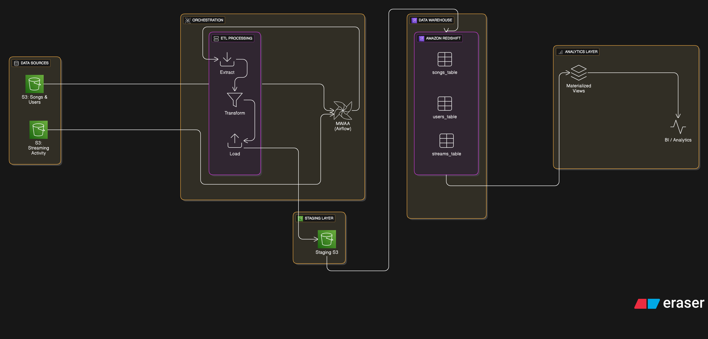
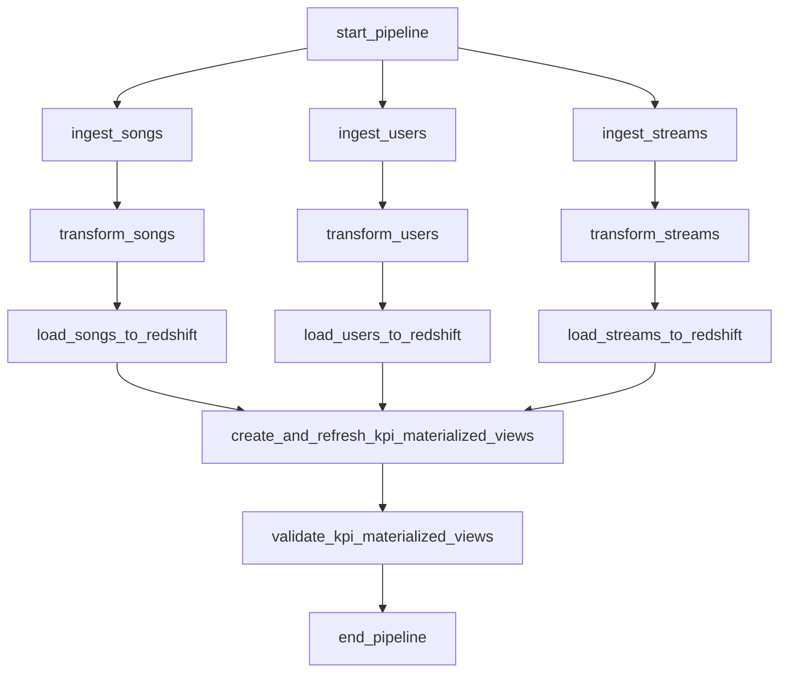

# Music Streaming ETL Pipeline Documentation

## Overview

This document outlines the **Music Streaming ETL Pipeline**, a robust and scalable data pipeline designed for processing music streaming data using **Apache Airflow** on **AWS Managed Workflows for Apache Airflow (MWAA)**. The pipeline ingests data from multiple sources, transforms it for analytical use, loads it into an **Amazon Redshift** data warehouse, and creates optimized **materialized views** for real-time business intelligence.

The pipeline is designed to:

- Ingest data from  **Amazon S3** buckets.
- Transform and clean data for analytics readiness.
- Load processed data into Redshift with optimized distribution and sort keys.
- Create and refresh KPI materialized views for real-time analytics.
- Ensure compatibility with MWAA through strict configuration management using **Airflow Variables** and **Airflow Connections**.

This documentation is intended for data engineers, analysts, and stakeholders who need to understand, deploy, or maintain the pipeline.

---

## Architecture



The pipeline is orchestrated using Apache Airflow and leverages AWS services for scalability and reliability. The key components are:

- **Data Sources**:

  - **Songs**: Metadata and audio features exported from Amazon RDS.
  - **Users**: Demographic and profile data exported from Amazon RDS.
  - **Streams**: Streaming activity logs stored in Amazon S3.

- **Storage**:

  - **Amazon S3**: Stores raw data, cleaned data, and processed file metadata.
  - **Amazon Redshift**: Data warehouse for storing transformed data and KPI materialized views.

- **Orchestration**:

  - **Apache Airflow (MWAA)**: Orchestrates the ETL pipeline with task dependencies and parallel processing.

- **Output**:

  - **Redshift Tables**: `songs_table`, `users_table`, `streams_table`.
  - **KPI Materialized Views**: `genre_kpis_materialized_view`, `hourly_kpis_materialized_view`.

---

## Pipeline Structure

The pipeline is defined in the following Python scripts, all of which are designed to be MWAA-compatible:

1. `mainETLpipeline.py`:

   - Defines the main Airflow DAG (`music_etl_pipeline_mwaa`).
   - Orchestrates the ETL process with tasks for ingestion, transformation, loading, and KPI view creation.
   - Configures task dependencies for parallel processing and ensures data integrity.

2. `ETL_s3_rEDShift.py`:

   - Handles data ingestion from S3, transformation using **pandas** and **pyarrow**, and loading into Redshift.
   - Implements atomic upsert logic to avoid data duplication.
   - Ensures schema compatibility with Redshift tables.

3. `kPIsandViews.py`:

   - Manages the creation and refreshing of Redshift materialized views for KPIs.
   - Includes validation checks to ensure views are correctly configured and populated.

---

## Prerequisites

To deploy and run the pipeline, ensure the following:

1. **AWS MWAA Environment**:

   - A configured MWAA environment with access to the necessary AWS services (S3, Redshift).
   - Airflow version compatible with the pipeline (tested with Airflow 2.7+).

2. **AWS IAM Roles**:

   - An IAM role for Redshift with permissions to execute `COPY` commands from S3.
   - MWAA execution role with permissions to access S3, Redshift, and necessary logging resources.

3. **Airflow Variables**:

   - Store configuration details in Airflow Variables (Admin &gt; Variables in the Airflow UI). The required variables are:
     - `s3_raw_bucket_songs`: S3 bucket for song data (e.g., `your-songs-bucket`).
     - `s3_raw_bucket_users`: S3 bucket for user data (e.g., `your-users-bucket`).
     - `s3_raw_bucket_streams`: S3 bucket for stream data (e.g., `your-streams-bucket`).
     - `s3_cleaned_bucket`: S3 bucket for cleaned data (e.g., `your-cleaned-bucket`).
     - `processed_files_bucket`: S3 bucket for processed file metadata (e.g., `your-processed-bucket`).
     - `redshift_iam_role`: ARN of the IAM role for Redshift access (e.g., `arn:aws:iam::your-account-id:role/your-redshift-role`).
     - `redshift_workgroup`: Redshift workgroup name (e.g., `your-workgroup`).
     - `redshift_database`: Redshift database name (e.g., `your-database`).
     - `aws_region`: AWS region for all services (e.g., `your-region`).

4. **Airflow Connections**:

   - Store AWS credentials and connection details in Airflow Connections (Admin &gt; Connections in the Airflow UI).
   - Create a connection (e.g., `aws_default`) with AWS credentials or rely on MWAA's IAM role-based authentication.

5. **Dependencies**:

   - Python packages: `boto3`, `pandas`, `pyarrow`.
   - Install dependencies via MWAA's `requirements.txt`:

     ```
     boto3>=1.28.0
     pandas>=2.0.0
     pyarrow>=10.0.0
     ```

6. **S3 Structure**:

   - Raw data buckets with prefixes: `songs/`, `users/`, `streams/`.
   - A cleaned data bucket for transformed data.
   - A processed files bucket with a `processed_files.json` file to track processed files.

7. **Redshift Schema**:

   - A Redshift database (e.g., `your-database`) with the `public` schema.
   - Ensure sufficient compute resources in the Redshift workgroup.

---

## Pipeline Workflow

The pipeline is defined in the `music_etl_pipeline_mwaa` DAG and consists of the following tasks:

### 1. Data Ingestion

- **Tasks**: `ingest_songs`, `ingest_users`, `ingest_streams`
- **Description**: Reads new CSV files from S3 buckets, combines them into a single DataFrame, and saves the result as a pickle file in the cleaned bucket.
- **Parallelization**: Runs in parallel for each dataset (songs, users, streams).
- **Output**: S3 keys for pickled DataFrames, pushed to XCom for downstream tasks.

### 2. Data Transformation

- **Tasks**: `transform_songs`, `transform_users`, `transform_streams`
- **Description**:
  - Loads pickled DataFrames from S3.
  - Cleans data (removes duplicates, handles NaN values, validates columns).
  - Applies dataset-specific transformations (e.g., calculates `user_tenure_days` for users, extracts `listen_hour` for streams).
  - Converts data to Parquet format with a Redshift-compatible schema.
- **Output**: S3 keys for Parquet files, pushed to XCom.

### 3. Data Loading

- **Tasks**: `load_songs_to_redshift`, `load_users_to_redshift`, `load_streams_to_redshift`
- **Description**:
  - Creates Redshift tables if they don't exist.
  - Loads Parquet files from S3 into Redshift using atomic upsert logic.
  - Uses `COPY` commands for efficient data loading and temporary staging tables for upserts.
- **Output**: Redshift tables (`songs_table`, `users_table`, `streams_table`).

### 4. KPI Materialized Views

- **Tasks**: `create_and_refresh_kpi_materialized_views`, `validate_kpi_materialized_views`
- **Description**:
  - Creates materialized views (`genre_kpis_materialized_view`, `hourly_kpis_materialized_view`) with optimized `DISTKEY` and `SORTKEY` configurations.
  - Refreshes views to ensure fresh data for analytics.
  - Validates view existence, configuration, and data population.
- **Output**: Materialized views ready for business intelligence queries.

### Task Dependencies

- Ingestion tasks run in parallel.
- Transformation tasks depend on their respective ingestion tasks.
- Loading tasks depend on their respective transformation tasks.
- KPI view creation waits for all loading tasks to complete.
- Validation follows KPI view creation.



---

## Configuration

### Airflow Variables

Store the following in Airflow Variables to configure the pipeline:

| Variable Name | Description | Example Value |
| --- | --- | --- |
| `s3_raw_bucket_songs` | S3 bucket for song data | `your-songs-bucket` |
| `s3_raw_bucket_users` | S3 bucket for user data | `your-users-bucket` |
| `s3_raw_bucket_streams` | S3 bucket for stream data | `your-streams-bucket` |
| `s3_cleaned_bucket` | S3 bucket for cleaned data | `your-cleaned-bucket` |
| `processed_files_bucket` | S3 bucket for processed file metadata | `your-processed-bucket` |
| `redshift_iam_role` | ARN of the IAM role for Redshift access | `arn:aws:iam::your-account-id:role/your-redshift-role` |
| `redshift_workgroup` | Redshift workgroup name | `your-workgroup` |
| `redshift_database` | Redshift database name | `your-database` |
| `aws_region` | AWS region for all services | `your-region` |

### Airflow Connections

- Configure an AWS connection (`aws_default`) in Airflow Connections.
- MWAA can use IAM role-based authentication, so credentials may not need to be explicitly stored if the MWAA execution role has appropriate permissions.

### Redshift Tables

The pipeline creates the following tables with the specified schemas:

#### `songs_table`

| Column | Type | Description |
| --- | --- | --- |
| `id` | BIGINT | Primary key |
| `track_id` | VARCHAR(256) | Song track ID |
| `artists` | VARCHAR(1024) | Artist names |
| `album_name` | VARCHAR(1024) | Album name |
| `track_name` | VARCHAR(1024) | Track name |
| `popularity` | INT | Popularity score |
| `duration_ms` | INT | Duration in milliseconds |
| `explicit` | BOOLEAN | Explicit content flag |
| `danceability` | FLOAT | Danceability score |
| `energy` | FLOAT | Energy score |
| `key` | INT | Musical key |
| `loudness` | FLOAT | Loudness in decibels |
| `mode` | INT | Musical mode |
| `speechiness` | FLOAT | Speechiness score |
| `acousticness` | FLOAT | Acousticness score |
| `instrumentalness` | FLOAT | Instrumentalness score |
| `liveness` | FLOAT | Liveness score |
| `valence` | FLOAT | Valence score |
| `tempo` | FLOAT | Tempo in BPM |
| `time_signature` | INT | Time signature |
| `track_genre` | VARCHAR(256) | Genre of the track |

#### `users_table`

| Column | Type | Description |
| --- | --- | --- |
| `user_id` | BIGINT | Primary key |
| `user_name` | VARCHAR(256) | User name |
| `user_age` | INT | User age |
| `user_country` | VARCHAR(256) | User country |
| `created_at` | TIMESTAMP | Account creation timestamp |
| `user_tenure_days` | INT | Days since account creation |

#### `streams_table`

| Column | Type | Description |
| --- | --- | --- |
| `user_id` | BIGINT | Part of composite primary key |
| `track_id` | VARCHAR(256) | Part of composite primary key |
| `listen_time` | TIMESTAMP | Part of composite primary key |
| `listen_hour` | INT | Hour of the day (0-23) |
| `listen_day_of_week` | INT | Day of week (0-6) |
| `listen_month` | INT | Month (1-12) |

### Materialized Views

The pipeline creates two materialized views for business intelligence:

#### `genre_kpis_materialized_view`

- **DISTKEY**: `track_genre`
- **SORTKEY**: `track_genre`, `listen_count`
- **Metrics**:
  - Listen counts per genre.
  - Average duration per genre.
  - Popularity index.
  - Unique listener counts.
  - Most popular track per genre.

#### `hourly_kpis_materialized_view`

- **DISTKEY**: `listen_hour`
- **SORTKEY**: `listen_hour`, `total_listens`
- **Metrics**:
  - Unique listeners per hour.
  - Unique tracks per hour.
  - Total listens per hour.
  - Average track popularity.
  - Top artist per hour.

---

## Deployment Instructions

1. **Set Up MWAA Environment**:

   - Create an MWAA environment in the desired AWS region.
   - Configure the execution role with permissions for S3, Redshift, and CloudWatch.

2. **Upload DAG Files**:

   - Place `mainETLpipeline.py`, `ETL_s3_rEDShift.py`, and `kPIsandViews.py` in the MWAA DAGs folder (e.g., `s3://your-mwaa-bucket/dags/`).

3. **Configure Airflow Variables**:

   - Import the required variables into the Airflow UI under Admin &gt; Variables.

4. **Configure Airflow Connections**:

   - Set up the `aws_default` connection or rely on MWAA's IAM role.

5. **Install Dependencies**:

   - Update the MWAA `requirements.txt` with the required Python packages.

6. **Trigger the DAG**:

   - The DAG (`music_etl_pipeline_mwaa`) is set to run manually (`schedule_interval=None`).
   - Trigger it via the Airflow UI or CLI: `airflow dags trigger music_etl_pipeline_mwaa`.

7. **Monitor Execution**:

   - Check the Airflow UI for task logs and status.
   - Verify Redshift tables and materialized views for data integrity.

---

## Monitoring and Maintenance

- **Logging**: Comprehensive logging is implemented in all scripts using MWAA-compatible logging (`logging.getLogger(__name__)`). Logs are written to CloudWatch.
- **Error Handling**: The pipeline includes retries (`retries=2`, `retry_delay=5 minutes`) and exponential backoff for task failures.
- **Validation**: The `validate_kpi_materialized_views` task checks materialized view existence, configuration, and data population.
- **Performance**:
  - Redshift tables and views use `DISTKEY` and `SORTKEY` for query optimization.
  - Parallel task execution minimizes runtime.
  - Atomic upsert logic ensures data integrity without session conflicts.

---

## Troubleshooting

| Issue | Possible Cause | Resolution |
| --- | --- | --- |
| Task fails with "NoSuchKey" | Missing files in S3 bucket | Verify S3 bucket and prefix configuration. |
| Redshift access denied | Incorrect IAM role | Check Redshift IAM role permissions. |
| Materialized view creation fails | View already exists | Check `materialized_view_exists` logs and drop conflicting views if needed. |
| Timeout errors | Large data volume or insufficient Redshift resources | Increase timeout values or scale Redshift workgroup. |
| Missing Airflow Variables | Variables not imported | Import variables in Airflow UI. |

---

## Future Enhancements

- **Scheduling**: Add a `schedule_interval` (e.g., daily) for automated runs.
- **Data Quality Checks**: Implement additional validation tasks for data completeness and accuracy.
- **Incremental Processing**: Enhance the pipeline to process only incremental data using timestamps.
- **Monitoring Dashboards**: Integrate with Amazon QuickSight for visualizing KPI metrics.

---

## Contact

For questions or issues, contact the Data Engineering team at \[your-team-email@example.com\].